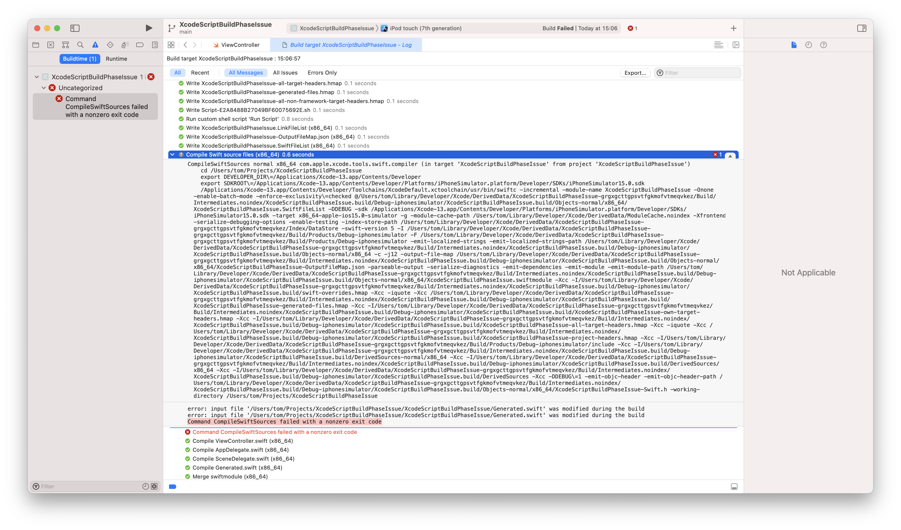

#  Xcode 13 - Script Build Phase Issue

This project demonstrates an issue with Xcode 13 and the "Run Script" build phase. This shows up when using a build phase for code generation, like in [R.swift](https://github.com/mac-cain13/R.swift/issues/719).

In Xcode 13, when a Run Script build phase touches a file that is used in the "Compile Sources" build phase, occasionally it will fail to build the project:

```
error: input file 'Generated.swift' was modified during the build
error: input file 'Generated.swift' was modified during the build
Command CompileSwiftSources failed with a nonzero exit code
```



In this example project, the issue mostly happens (on my machine) when doing a clean build. But this may be different for you, depending on the speed of your development machine.

The issue seems to be caused by multiple build phases (incorrectly) being run in parallel, this causes the problem to appear at random, depending on environmental factors.

## Steps to reproduce

1. Add a file "Generated.swift" to your project, add it to your target
1. In the build phases, at a "Run Script" build phase before "Compile Sources":
   ```
   echo // $(date) >> $SRCROOT/Generated.swift
   say generate
   ```
1. In Xcode 13, do a clean build, or an archive build. The build issues should appear
1. If the build completes successfully, clean the build folder, or modify some files and try again

This issue does not happen with Xcode 12

## `say generate`

Note, this example project includes a "say" command, so you can hear when the "Run Script" is executed. This also appears to happen way too often in Xcode 13, compared to Xcode 12.
